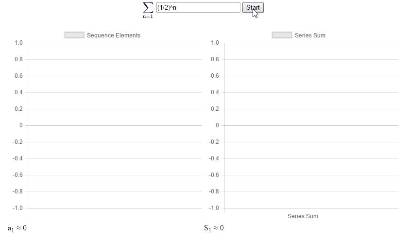

# AP Calculus BC Final Project
---
For my second semester final project in AP Calculus BC, I decided to make a visualization of the relationship between sequences and series. This is one of the most important and difficult topics in AP Calculus BC. Understanding the concept can be simplified by tinkering with the equations and observing the consequences. [Try The Web App](http://akshaykalose.github.io/APCalculusBCFinal)

# Examples

## Harmonic Series (Diverges)

## Alternating Harmonic Series (Converges)

## Geometric Series (Converges)

## Open Source Software Used

- [Chart.js](http://www.chartjs.org/)
- [math.js](http://mathjs.org/)
- [MathJax](https://www.mathjax.org/)
